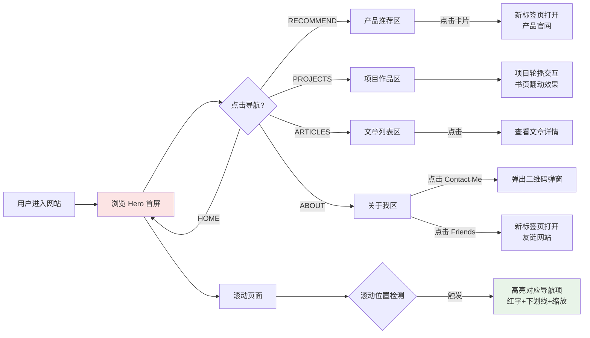

# PRD-001: 克莱恩，你的AI搭子 - 个人作品集网站

## 1. 项目概述

### 1.1 产品定位
一个展示个人 AI 探索历程的作品集网站，包含产品推荐、项目展示、文章分享和个人介绍。

### 1.2 目标用户
- 对 AI 工具感兴趣的开发者
- 寻求效率工具推荐的职场人士
- 希望交流 AI 应用的产品经理

### 1.3 核心目标
- 展示个人专业形象
- 推荐优质 AI 工具
- 分享实践经验
- 建立连接渠道

---

## 2. 用户旅程地图

```
┌─────────────────────────────────────────────────────────────────────────────┐
│                        用户旅程地图 (User Journey Map)                       │
├─────────────────────────────────────────────────────────────────────────────┤
│                                                                             │
│  ┌──────────┐    ┌──────────┐    ┌──────────┐    ┌──────────┐    ┌────────┐│
│  │ 阶段 1   │───▶│ 阶段 2   │───▶│ 阶段 3   │───▶│ 阶段 4   │───▶│ 阶段 5 ││
│  │ 首屏印象 │    │ 产品推荐 │    │ 作品浏览 │    │ 文章阅读 │    │ 关于我 ││
│  │ (Home)   │    │(Recommend)│   │(Projects)│    │(Articles)│    │ (About)││
│  └──────────┘    └──────────┘    └──────────┘    └──────────┘    └────────┘│
│        │              │               │              │              │      │
│        ▼              ▼               ▼              ▼              ▼      │
│   • 品牌认知      • 推荐卡片       • 项目轮播      • 文章列表      • 联系合作│
│   • 快速导航      • 外链跳转       • 详情入口      • 阅读入口      • 友情链接│
│   • CTA 引导      • 工具展示       • 案例展示      • 分类标签      • 二维码  │
│                                                                             │
└─────────────────────────────────────────────────────────────────────────────┘
```

---

## 3. 全局交互流程



---

## 4. 用户故事

### US-01: 固定导航栏与锚点滚动

**故事描述**
作为访客，我希望点击导航菜单后平滑滚动到对应分区，并在滚动页面时看到当前所在区域的导航项被高亮。

**业务规则与逻辑**
| 属性 | 定义 |
|------|------|
| 导航位置 | 固定顶部，始终可见 |
| 导航项 | HOME / RECOMMEND / PROJECTS / ARTICLES / ABOUT |
| 滚动行为 | 平滑滚动，时长 600-800ms |
| 高亮触发 | 滚动位置进入对应区域 50% 视口时触发 |

**选中状态样式**
| 元素 | 样式 |
|------|------|
| 文字颜色 | 红色 (#dc2626) |
| 下划线 | 红色短下划线，位于文字下方 2px |
| 放大效果 | scale: 1.0 → 1.1，过渡 200ms |

**异常处理**
- 点击相同导航项：无响应
- 快速连续点击：防抖处理，防止动画冲突

**验收标准**
- [ ] 导航栏固定在顶部，滚动时不消失
- [ ] 点击导航项平滑滚动到对应锚点区域
- [ ] 滚动到不同区域时，对应导航项高亮（红字+下划线+zoom in）
- [ ] 移动端适配为汉堡菜单

**ASCII 线框图**
```
┌─────────────────────────────────────────────────────────────────────────────┐
│  🔶  克莱恩的AI搭子          HOME    RECOMMEND    PROJECTS    ARTICLES    ABOUT│
│                                                                             │
│  [Logo区 - 左对齐]                          [导航项 - 右对齐，等间距分布]   │
│                                                                             │
│  高亮状态示例：                                                              │
│  ┌─────────────────────────────────────────────────────────────────────────┐│
│  │  🔶  克莱恩的AI搭子          HOME    RECOMMEND    PROJECTS    ARTICLES   ││
│  │                                          [bold][red][underline]        ││
│  │                                               ▲                        ││
│  │                                          [缩放至 1.1x]                 ││
│  └─────────────────────────────────────────────────────────────────────────┘│
└─────────────────────────────────────────────────────────────────────────────┘
```

---

### US-02: Hero 首屏区域

**故事描述**
作为访客，我进入网站后首先看到个人品牌展示区，了解站主身份定位，并能快速跳转到博客或作品区。

**内容清单**
| 元素 | 文案/内容 |
|------|-----------|
| 标签 | PORTFOLIO 2026（左侧红色短线装饰）|
| LOGO | https://res.cloudinary.com/de6byedfx/image/upload/v1770045720/2026/02/fad1d1961c02fb9b8fd0c1823134b85e.png |
| 主标题 | HELLO.（句号为红色方块 ■）|
| 副标题 | 我是克莱恩，AI 时代的探索者 |
| 身份 | 一个干了多年研发的 B 端产品经理 |
| 英文标语 | The difference between just getting it done and doing it right is often **just a little bit more effort**. But it’s the difference between something that’s mediocre and something that’s great. |
| 特色文案 | 拥抱AI，给你的人生提提效。（左侧红色竖线装饰）|
| CTA按钮1 | 查看博客 ↓（深色黑底白字，带向下箭头）|
| CTA按钮2 | 查看 AI 作品集 ↗（浅色白底黑框，带右上箭头）|

**项目轮播规则**
| 属性 | 定义 |
|------|------|
| 展示形式 | 书页翻动层叠效果，多层卡片错位层叠 |
| 动画方向 | 右压左（新卡片从右侧滑入覆盖）|
| 自动播放 | 3 秒间隔 |
| 切换动画 | 600ms ease-out |
| 控制按钮 | 左右箭头 + 指示器圆点 + 自动播放开关 |

**CTA 按钮行为**
| 按钮 | 行为 |
|------|------|
| 查看博客 | 平滑滚动到 Articles 区域 |
| 查看 AI 作品 | 平滑滚动到 Projects 区域 |

**异常处理**
- 轮播到最后一页：循环回到第一页
- 用户手动切换：重置自动播放计时器
- 鼠标悬停：暂停自动播放

**验收标准**
- [ ] 粉色渐变背景正确显示（#fce4e4 → #fff）
- [ ] 所有文案正确渲染，特殊装饰（红色方块、波浪线）正确显示
- [ ] 项目轮播以书页翻动效果自动播放，3秒间隔
- [ ] 点击左右箭头可手动切换，悬停暂停自动播放
- [ ] CTA 按钮点击后平滑滚动到对应区域
- [ ] 社交图标点击弹出二维码弹窗

**ASCII 线框图**
```
┌─────────────────────────────────────────────────────────────────────────────┐
│  [粉色渐变背景：#fce4e4 ────────────────────────────────────────────────> #fff]│
│                                                                             │
│  ┌──────────────────────────────┐    ┌──────────────────────────────────┐  │
│  │  ── PORTFOLIO 2026           │    │  ┌────────────────────────────┐  │  │
│  │                              │    │  │ ┌────────────────────────┐ │  │  │
│  │  HELLO■                      │    │  │ │ ┌────────────────────┐ │ │  │  │
│  │       [红色方块句号]         │    │  │ │ │  ┌──────────────┐  │ │ │  │  │
│  │                              │    │  │ │ │  │   DEV-06     │  │ │ │  │  │
│  │  我是克莱恩，                │    │  │ │ │  │              │  │ │ │  │  │
│  │  AI 时代的探索者             │    │  │ │ │  │ 博客生态插件 │  │ │ │  │  │
│  │      ﹏﹏ [波浪下划线]       │    │  │ │ │  │ 开发         │  │ │ │  │  │
│  │                              │    │  │ │ │  │ ──────       │  │ │ │  │  │
│  │  一个干了多年研发的          │    │  │ │ │  │ DETAILS  ↗  │  │ │ │  │  │
│  │  B 端产品经理                │    │  │ │ │  └──────────────┘  │ │ │  │  │
│  │                              │    │  │ │ └────────────────────┘ │ │  │  │
│  │  Building digital products   │    │  │ └────────────────────────┘ │  │  │
│  │  that matter.                │    │  └────────────────────────────┘  │  │
│  │                              │    │                                  │  │
│  │  │ 拥抱AI，给你的人生提提效。            │    │                                  │  │
│  │                              │    │  [书页层叠效果：多层卡片错位展示]  │  │
│  │  ┌──────────┐ ┌──────────┐  │    │                                  │  │
│  │  │查看博客 ↓│ │查看AI作品↗│  │    │                                  │  │
│  │  │ [黑底]   │ │ [白底框] │  │    │                                  │  │
│  │  └──────────┘ └──────────┘  │    │                                  │  │
│  │                              │    │                                  │  │
│  │  [💬] [📕] [🎵] [🐙] [📺]   │    │                                  │  │
│  └──────────────────────────────┘    └──────────────────────────────────┘  │
└─────────────────────────────────────────────────────────────────────────────┘
```

---

### US-03: 产品推荐区 (Recommend)

**故事描述**
作为访客，我可以在产品推荐区看到站主推荐的实用工具，点击卡片跳转到对应官网。

**产品清单**
| 产品 | 图标 | 描述 | 跳转链接 |
|------|------|------|----------|
| Raycast | 官网 Logo | 全能的 AI 助手 | https://www.raycast.com |
| Typeless | 官网 Logo | AI 驱动的效率工具 | https://www.typeless.com |
| Gemini | 官网 Logo | Google AI 助手 | https://gemini.google.com |
| Kimi | 官网 Logo | 国产 AI 长文本助手 | https://kimi.moonshot.cn |

**业务规则与逻辑**
| 属性 | 定义 |
|------|------|
| 布局 | 响应式网格，桌面端 4 列，平板 2 列，手机 1 列 |
| 卡片尺寸 | 等宽等高，支持多行自动换行 |
| 点击区域 | 整张卡片可点击 |
| 跳转方式 | 新标签页打开（target="_blank"）|
| 悬停效果 | 卡片上浮 + 阴影增强 |

**异常处理**
- 图标加载失败：显示占位图标
- 外链无法打开：正常跳转，由浏览器处理

**验收标准**
- [ ] 4 张产品卡片以网格形式展示
- [ ] 每张卡片显示产品图标、名称、描述
- [ ] 点击卡片在新标签页打开对应官网
- [ ] 悬停时卡片有上浮阴影效果
- [ ] 响应式布局，不同屏幕尺寸自适应

**ASCII 线框图**
```
┌─────────────────────────────────────────────────────────────────────────────┐
│                                                                             │
│  ■ RECOMMEND                    产品推荐                                    │
│                                                                             │
│  ┌─────────────────┐  ┌─────────────────┐  ┌─────────────────┐  ┌──────────┐│
│  │   ┌─────────┐   │  │   ┌─────────┐   │  │   ┌─────────┐   │  │ ┌──────┐ ││
│  │   │  [◆]   │   │  │   │  [◇]   │   │  │   │  [◆]   │   │  │ │ [◇] │ ││
│  │   │ Raycast │   │  │   │ Typeless│   │  │   │ Gemini  │   │  │ │ Kimi │ ││
│  │   │  Logo   │   │  │   │  Logo   │   │  │   │  Logo   │   │  │ │ Logo │ ││
│  │   └─────────┘   │  │   └─────────┘   │  │   └─────────┘   │  │ └──────┘ ││
│  │                 │  │                 │  │                 │  │          ││
│  │    Raycast      │  │    Typeless     │  │     Gemini      │  │   Kimi   ││
│  │                 │  │                 │  │                 │  │          ││
│  │ 全能的 AI 助手  │  │ AI驱动的效率工具 │  │ Google AI 助手  │  │国产AI长  ││
│  │                 │  │                 │  │                 │  │文本助手  ││
│  └─────────────────┘  └─────────────────┘  └─────────────────┘  └──────────┘│
│                                                                             │
│  [悬停效果：卡片上浮 4px，阴影加深]                                          │
│  [点击行为：整张卡片可点击，新标签页打开官网]                                 │
│                                                                             │
└─────────────────────────────────────────────────────────────────────────────┘
```

---

### US-04: 项目作品区 (Projects)

**故事描述**
作为访客，我可以浏览站主的项目作品，通过轮播查看不同项目的概览。

**业务规则与逻辑**
| 属性 | 定义 |
|------|------|
| 展示内容 | 与 Hero 区轮播相同的一组项目 |
| 展示形式 | 书页翻动层叠轮播 |
| 卡片内容 | 项目截图 + DEV-XX 标签 + 项目标题 + DETAILS 按钮 |
| 自动播放 | 3 秒间隔 |
| 动画方向 | 右压左 |

**项目清单**
| 项目 | 图标 | 描述 | 跳转链接 |
|------|------|------|----------|
| Global Markets | 地球的emoji | 股市指数信息查询 |[Enter](https://fb10b3921cc049d695743eeab389fbd2.prod.enter.pro/) |
| 乐透人生 | 彩票相关的emoji | 抽奖工具 | lottery-life-six.vercel.app |

**验收标准**
- [ ] 展示项目轮播，与 Hero 区同一组内容
- [ ] 书页翻动层叠效果正确显示
- [ ] 支持手动切换和自动播放
- [ ] 悬停暂停自动播放

---

### US-05: 文章列表区 (Articles)

**故事描述**
作为访客，我可以浏览站主发布的最新文章，点击查看感兴趣的文章详情。

**业务规则与逻辑**
| 属性 | 定义 |
|------|------|
| 标题 | LATEST TRANSMISSIONS / 最新文章 |
| 布局 | 三列网格 |
| 右上角 | VIEW ALL 链接 |
| 卡片结构 | 图片 + LOG_XXX 标签 + 分类标签 + 标题 + 摘要 + 日期 + READ 按钮 |

**文章卡片结构**
| 元素 | 说明 |
|------|------|
| 封面图 | 文章主题相关图片 |
| 标签 | LOG_001 / LOG_002 / LOG_003 等 |
| 分类标签 | WAYTOAGI / AI SOP / AI EFFICIENCY 等 |
| 标题 | 文章标题 |
| 摘要 | 文章摘要，最多 2-3 行 |
| 日期 | 2026/01/15 格式 |
| 操作 | READ ↗ 按钮 |

**验收标准**
- [ ] 文章列表以三列网格展示
- [ ] 每张卡片包含图片、标签、标题、摘要、日期
- [ ] 点击 READ 按钮跳转到文章详情页
- [ ] VIEW ALL 链接跳转到文章列表完整页

**ASCII 线框图**
```
┌─────────────────────────────────────────────────────────────────────────────┐
│                                                                             │
│  ■ LATEST TRANSMISSIONS                    最新文章          VIEW ALL ↗    │
│                                                                             │
│  ┌─────────────────────┐  ┌─────────────────────┐  ┌─────────────────────┐│
│  │ ┌─────────────────┐ │  │ ┌─────────────────┐ │  │ ┌─────────────────┐ ││
│  │ │    [文章配图]    │ │  │ │    [文章配图]    │ │  │ │    [文章配图]    │ ││
│  │ │                 │ │  │ │                 │ │  │ │                 │ ││
│  │ │   LOG_001       │ │  │ │   LOG_002       │ │  │ │   LOG_003       │ ││
│  │ └─────────────────┘ │  │ └─────────────────┘ │  │ └─────────────────┘ ││
│  │                     │  │                     │  │                     ││
│  │ [WAYTOAGI] [AI SOP] │  │ [AI EFF] [GOOGLE]   │  │ [DEVOPS] [CLAUDE]   ││
│  │                     │  │                     │  │                     ││
│  │ Skills火了，但我... │  │ 写方案没思路？我用  │  │ 别折腾环境了！用zcf ││
│  │                     │  │ notebooklm...       │  │ 一键搞定Claude...   ││
│  │ 文章针对当前AI领域  │  │ 本文作者分享了自己  │  │ 本文介绍了一种使用  ││
│  │ 流行的Skills热潮... │  │ 利用Google          │  │ zcf工具快速配置...  ││
│  │                     │  │ NotebookLM...       │  │                     ││
│  │ ─────────────────── │  │ ─────────────────── │  │ ─────────────────── ││
│  │ 📅 2026/01/15    READ│  │ 📅 2026/01/13   READ│  │ 📅 2026/01/08   READ││
│  └─────────────────────┘  └─────────────────────┘  └─────────────────────┘│
│                                                                             │
└─────────────────────────────────────────────────────────────────────────────┘
```

---

### US-06: 关于我区 (About)

**故事描述**
作为访客，我可以在关于我区了解如何与站主联系，并浏览推荐的友链网站。

**区域结构**
| 区块 | 内容 | 交互 |
|------|------|------|
| NEXT STEPS | Start a Project 标题 + 简介 + CONTACT ME 按钮 | 按钮点击弹出二维码 |
| Friends | WayToAGI / LangChain / OpenAI / Vercel | 点击跳转对应官网 |
| Footer | 版权信息 | 静态展示 |

**文案内容**
| 元素 | 内容 |
|------|------|
| 小标题 | NEXT STEPS |
| 大标题 | Start a Project |
| 描述 | 有好的想法？我们一起聊聊。 |
| 按钮 | CONTACT ME ↗ |

**Friends 链接映射**
| 名称 | 跳转链接 |
|------|----------|
| WayToAGI | https://www.waytoagi.com |
| LangChain | https://www.langchain.com/ |
| OpenAI | https://openai.com |
| Vercel | https://vercel.com |

**二维码弹窗**
| 属性 | 定义 |
|------|------|
| 触发方式 | 点击 CONTACT ME 按钮 |
| 弹窗内容 | 微信二维码图片 |
| 关闭方式 | 点击遮罩层或关闭按钮 |
| 动画 | 淡入淡出 200ms |

**验收标准**
- [ ] About 区展示 NEXT STEPS 文案和 CONTACT ME 按钮
- [ ] Friends 区域展示 4 个友链
- [ ] 点击 Friends 链接在新标签页打开对应官网
- [ ] 点击 CONTACT ME 弹出微信二维码弹窗
- [ ] 弹窗可点击遮罩或关闭按钮关闭

**ASCII 线框图**
```
┌─────────────────────────────────────────────────────────────────────────────┐
│  [深色背景 #1a1a1a 或 #111]                                                 │
│                                                                             │
│  ┌─────────────────────┐  ┌───────────────────┐  ┌─────────────────────┐   │
│  │  ■ NEXT STEPS       │  │  SOCIALS          │  │  FRIENDS            │   │
│  │                     │  │  [已移除]         │  │                     │   │
│  │  Start a Project    │  │                   │  │  WayToAGI      ────▶│   │
│  │                     │  │                   │  │  LangChain     ────▶│   │
│  │  与AI交朋友，跟着大 │  │                   │  │  OpenAI        ────▶│   │
│  │  熊一起AI，拒绝焦虑 │  │                   │  │  Vercel        ────▶│   │
│  │                     │  │                   │  │                     │   │
│  │  有好的想法？我们   │  │                   │  │                     │   │
│  │  一起聊聊。         │  │                   │  │                     │   │
│  │                     │  │                   │  │                     │   │
│  │  ┌──────────────┐   │  │                   │  │                     │   │
│  │  │ CONTACT ME ↗ │   │  │                   │  │                     │   │
│  │  │ [白底黑字]   │   │  │                   │  │                     │   │
│  │  └──────────────┘   │  │                   │  │                     │   │
│  └─────────────────────┘  └───────────────────┘  └─────────────────────┘   │
│                                                                             │
│  ─────────────────────────────────────────────────────────────────────────  │
│  © 2026 克莱恩. All Rights Reserved.                        备案号: XXX    │
│                                                                             │
└─────────────────────────────────────────────────────────────────────────────┘

二维码弹窗：
┌─────────────────────────────────┐
│                                 │
│    ┌─────────────────────┐      │
│    │                     │      │
│    │    [微信二维码]      │      │
│    │                     │      │
│    │    ┌───┐ ┌───┐      │      │
│    │    │ ■ │ │ ■ │      │      │
│    │    └───┘ └───┘      │      │
│    │         ...         │      │
│    │                     │      │
│    └─────────────────────┘      │
│                                 │
│      扫码添加微信               │
│                                 │
│           [关闭]                │
│                                 │
└─────────────────────────────────┘
```

---

## 5. 全局样式规范

### 5.1 色彩系统
| 名称 | 色值 | 用途 |
|------|------|------|
| 主红色 | #dc2626 | 强调色、链接、按钮 |
| 背景渐变起始 | #fce4e4 | Hero 背景顶部 |
| 背景渐变结束 | #ffffff | Hero 背景底部 |
| 文字主色 | #111111 | 标题、正文 |
| 文字次要 | #666666 | 描述、辅助文字 |
| 边框色 | #e5e5e5 | 卡片边框、分割线 |
| 深色背景 | #111111 | About 区域背景 |

### 5.2 字体规范
| 层级 | 字号 | 字重 | 行高 |
|------|------|------|------|
| 大标题 | 72px / 4.5rem | 700 | 1.1 |
| 副标题 | 48px / 3rem | 700 | 1.2 |
| 区域标题 | 32px / 2rem | 600 | 1.3 |
| 正文 | 16px / 1rem | 400 | 1.6 |
| 小标签 | 12px / 0.75rem | 500 | 1.4 |

### 5.3 间距规范
| 元素 | 数值 |
|------|------|
| 页面最大宽度 | 1280px |
| 区域上下间距 | 80px - 120px |
| 卡片间隙 | 24px |
| 内边距（桌面）| 48px |
| 内边距（移动端）| 16px |

### 5.4 动效规范
| 效果 | 时长 | 缓动函数 |
|------|------|----------|
| 平滑滚动 | 600-800ms | ease-in-out |
| 导航高亮缩放 | 200ms | ease-out |
| 卡片悬停上浮 | 200ms | ease-out |
| 轮播切换 | 600ms | ease-out |
| 弹窗淡入 | 200ms | ease-out |

---

## 6. 响应式断点

| 断点 | 宽度 | 适配 |
|------|------|------|
| 桌面大屏 | ≥1440px | 最大宽度限制，居中显示 |
| 桌面 | 1024px - 1439px | 标准布局 |
| 平板 | 768px - 1023px | 产品/文章两列 |
| 手机横屏 | 480px - 767px | 单列，简化动效 |
| 手机 | <480px | 单列，汉堡菜单 |

---

## 7. 非目标（Out of Scope）

- 后端 API 接口开发
- 用户登录/注册系统
- 文章 CMS 管理后台
- 多语言国际化（i18n）
- 暗黑模式切换
- 页面访问统计分析

---

## 8. 技术建议

- 框架：React / Vue / Next.js
- 样式：Tailwind CSS / Styled Components
- 动画：Framer Motion / GSAP
- 图标：Lucide / Heroicons
- 响应式：Mobile First 策略

---

## 10. 部署与安全

### 10.1 部署平台
- **Frontend**: Vercel (推荐)
- **Database**: Supabase
- **Environment Variables**:
  - `NEXT_PUBLIC_SUPABASE_URL`
  - `NEXT_PUBLIC_SUPABASE_ANON_KEY`

### 10.2 安全策略
- **代码仓库**: GitHub (Private/Public)
- **敏感信息**: 
  - 所有密钥存储在 `.env.local`
  - `.env.local` 必须加入 `.gitignore`
  - 生产环境密钥在 Vercel控制台 配置
- **文档管理**: `docs/` 目录不上传至 GitHub，包含 PRD 等敏感文档

---

## 9. 验收检查清单

### 功能验收
- [ ] 所有导航锚点跳转正常
- [ ] 滚动时导航高亮同步
- [ ] Hero 轮播自动播放和手动切换正常
- [ ] 产品卡片点击跳转正常
- [ ] 文章列表展示正常
- [ ] 二维码弹窗正常弹出和关闭
- [ ] Friends 链接跳转正常

### 视觉验收
- [ ] 颜色与设计规范一致
- [ ] 字体渲染正常
- [ ] 响应式布局各断点正常
- [ ] 动效流畅无卡顿
- [ ] 图片加载正常

### 性能验收
- [ ] 首屏加载 < 3s
- [ ] 图片懒加载
- [ ] 动画 60fps

---

*文档版本: 1.0*
*创建日期: 2026-02-02*
*作者: PRD Assistant*
